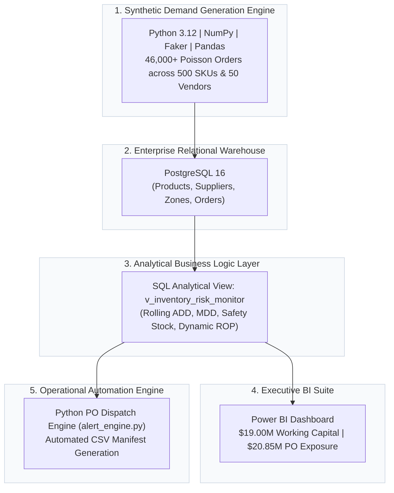

# Enterprise Inventory Risk Engine & Automated Replenishment System

[](https://www.postgresql.org/)
[](https://www.python.org/)
[](https://powerbi.microsoft.com/)
[](https://opensource.org/licenses/MIT)

> **An end-to-end supply chain decision-support system modeling an enterprise retail distribution network (Carltren Supply Logistics). The platform calculates dynamic safety stock and Reorder Points (ROP) under supplier lead-time uncertainty, surfaces working capital risk in an executive Power BI suite, and dispatches automated daily Purchase Order (PO) manifests via Python.**

---

## 📊 Executive Dashboard Preview


---

## 🏗️ System Architecture



## 📐 Mathematical & Supply Chain Foundations

Static minimum buffers fail during volatile supplier delays. This system dynamically calculates safety stock and order triggers per SKU across a rolling 180-day sales observation window:

* **Average Daily Demand ($\text{ADD}$)**:
  $$\text{ADD}_i = \frac{1}{180} \sum_{t=1}^{180} \text{DailySales}_{i,t}$$

* **Maximum Daily Demand ($\text{MDD}$)**:
  $$\text{MDD}_i = \max(\text{DailySales}_{i,1}, \dots, \text{DailySales}_{i,180})$$

* **Vendor Reliability Lead-Time Adjustment**:
  $$\text{Max Lead Time}_i = \text{Base Lead Time}_i \times \left(1 + (1 - \text{Reliability Score}_i)\right)$$

* **Dynamic Safety Stock ($\text{SS}$)**:
  $$\text{SS}_i = (\text{MDD}_i \times \text{Max Lead Time}_i) - (\text{ADD}_i \times \text{Base Lead Time}_i)$$

* **Reorder Point ($\text{ROP}$)**:
  $$\text{ROP}_i = (\text{ADD}_i \times \text{Base Lead Time}_i) + \text{SS}_i$$

* **Days of Inventory Remaining ($\text{DIR}$)**:
  $$\text{DIR}_i = \frac{\text{Current Stock}_i}{\text{ADD}_i}$$

---

## 🚦 Exception Management Classifications

| Status | Trigger Condition | Operational Action |
| :--- | :--- | :--- |
| **`CRITICAL`** | $\text{DIR} \le 7\text{ Days}$ **OR** $\text{Stock} \le \text{Safety Stock}$ | Immediate Purchase Order generation; expedited vendor dispatch. |
| **`WARNING`** | $\text{Stock} \le \text{ROP}$ | Queue SKU for standard batch reorder cycle. |
| **`OVERSTOCKED`** | $\text{DIR} > 60\text{ Days}$ | Freeze replenishment POs; evaluate promotion/liquidation. |
| **`HEALTHY`** | $7 < \text{DIR} \le 60\text{ Days}$ | Nominal baseline; maintain standard monitoring. |

---

## 📁 Repository Structure

├── python_engine/
│   ├── generate_data.py          # Synthetic Poisson sales generator (Faker, NumPy)
│   └── alert_engine.py           # Automated PO manifest extraction engine
├── sql/
│   ├── schema.sql                # PostgreSQL DDL table definitions
│   └── v_inventory_risk_monitor.sql # Multi-tier analytical SQL view
├── dispatch_orders/              # Automated output folder for timestamped POs
├── docs/
│   └── dashboard_overview.png    # Power BI dashboard screenshot
├── requirements.txt              # Python library dependencies
├── .gitignore
└── README.md

---

## 🚀 Setup & Execution Guide

### 1. Prerequisites & Environment Setup
```bash
# Clone the repository
git clone [https://github.com/tinotendamarufetu/enterprise-inventory-stockout-monitor.git](https://github.com/tinotendamarufetu/enterprise-inventory-stockout-monitor.git)
cd enterprise-inventory-stockout-monitor

# Create and activate virtual environment
python -m venv venv
source venv/bin/activate  # On Windows: .\venv\Scripts\activate

# Install dependencies
pip install -r requirements.txt

2. Database Ingestion
Ensure PostgreSQL is running locally, then initialize the database and populate simulated transactions:

python python_engine/generate_data.py

3. Build Analytical Database View
Execute the view definition inside PostgreSQL:

psql -U postgres -d inventory_db -f sql/v_inventory_risk_monitor.sql

4. Run Daily Replenishment Dispatch Engine

python python_engine/alert_engine.py

Outputs a timestamped CSV order manifest in dispatch_orders/.

📈 Key Metrics & Results
- Catalog Monitored: 500 active SKUs across 6 distribution categories.
- Working Capital Tracked: $19.00M across regional fulfillment nodes.
- Replenishment Exposure Identified: $20.85M across 261 critical and 16 warning SKUs.
- Automation SLA: Reduced stockout auditing and manual vendor reconciliation from multi-hour spreadsheet reviews to real-time programmatic extraction.

👤 Author
Tinotenda Muchenje
Master of Science in Data Science | Enterprise Analytics & Supply Chain Systems
LinkedIn: linkedin.com/in/tinomaruz
Medium: @tinotendamarufetu


